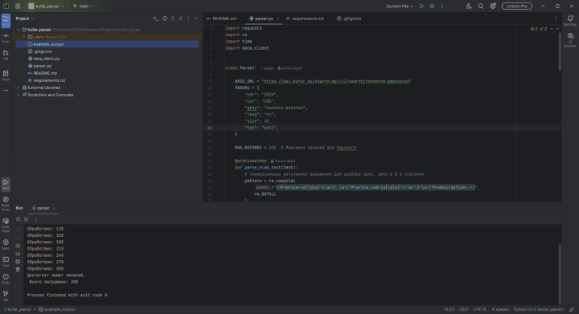
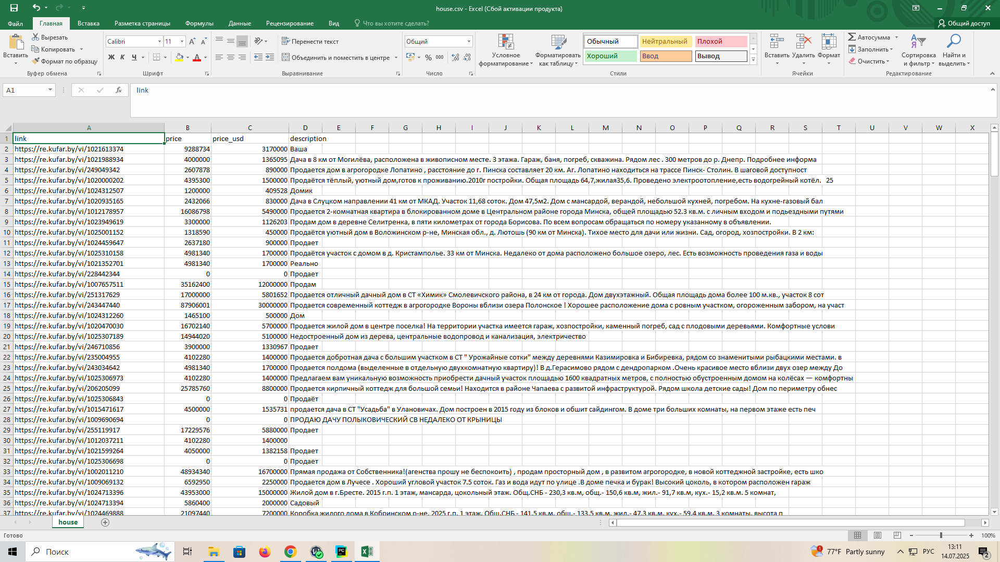

#  Парсер объявлений с Kufar.by (Python)

Скрипт для автоматического сбора объявлений о продаже домов с сайта [Kufar.by](https://kufar.by), с сохранением данных в CSV, SQLite или PostgreSQL. Подходит для анализа цен, выгрузки в таблицы и последующей обработки.

---

##  Возможности

-  Парсинг до 300 объявлений (лимит можно изменить)
-  Использование официального API Kufar
-  Сбор:
  - Ссылки на объявление
  - Цены в BYN и USD
  - Краткого описания
-  Сохранение в:
  - CSV-файл
  - SQLite
  - PostgreSQL

---

##  Установка

```bash
git clone https://github.com/AnnaLida29/kufar-parser.git
cd kufar-parser
pip install -r requirements.txt

##  Запуск
В файле parser.py выберите нужный клиент:
self.data_client_imp = data_client.CsvClient()

Другие доступные:
data_client.Sqlite3Client()
data_client.PostgresClient()

## Запуск парсера:
python parser.py


Если используете PostgresClient, убедитесь, что вы настроили соединение в data_client.py:
USER = "postgres"
PASSWORD = "postgres"
HOST = "127.0.0.1"
PORT = "5432"
DATABASE = "postgres_parse"

##Зависимости:

requests
psycopg2-binary

Установка:
pip install -r requirements.txt

---

## 🎥 Демонстрация работы

> Как работает парсер при запуске



---

## 🗃 Пример результата в Excel

> Вот как выглядит выгрузка объявлений в формате CSV, открытая в Excel




🧑‍💻 Автор
✍️ Анна — Python-разработчик и аналитик данных.
💬 Telegram: @annalida80
📫 Email: annalida80@gmail.com


